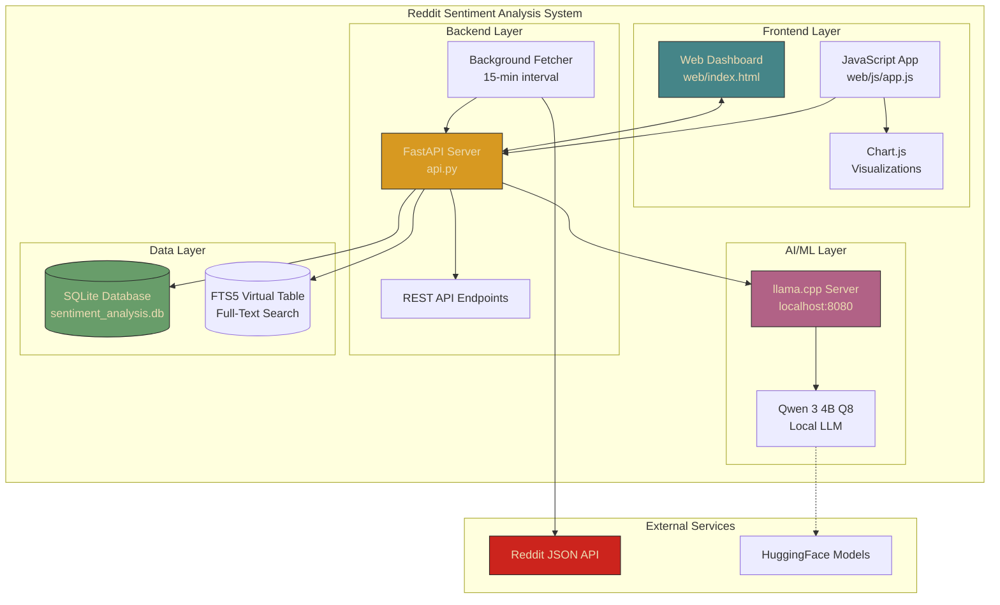
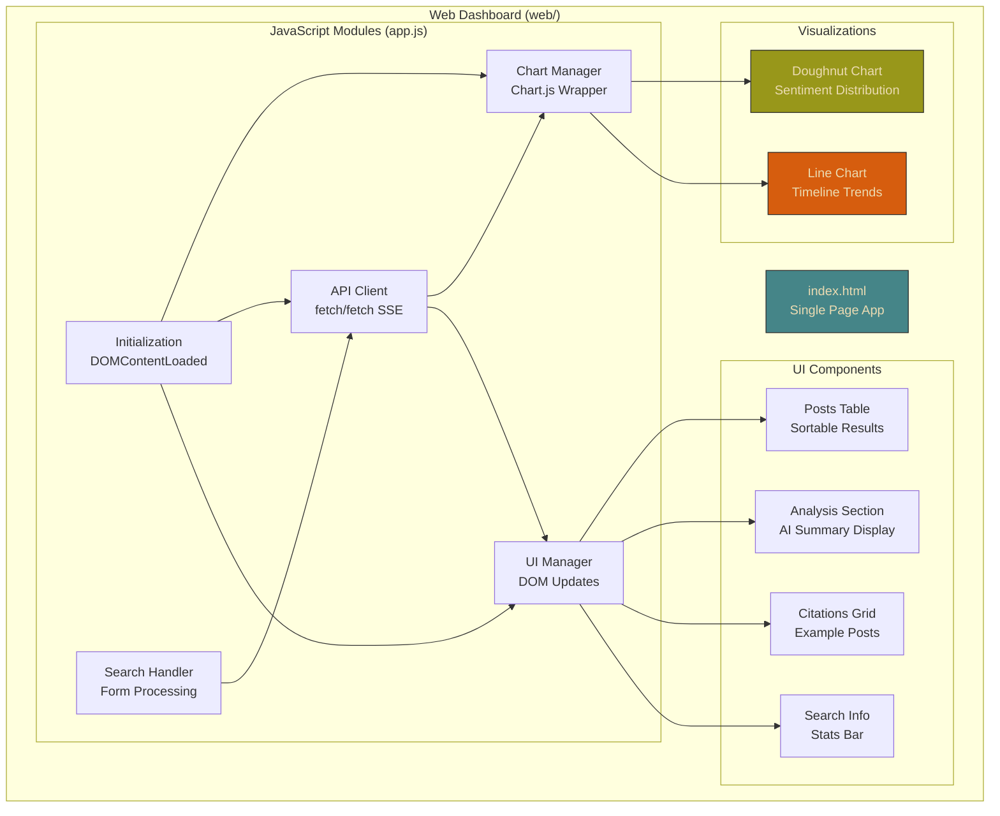
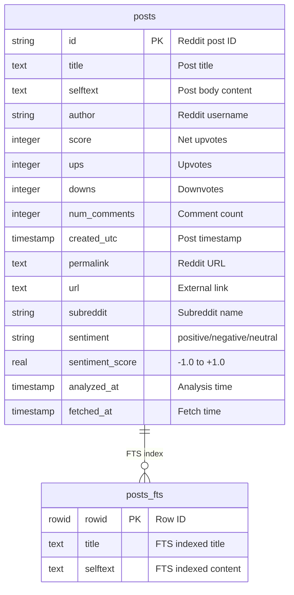
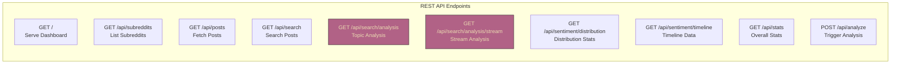
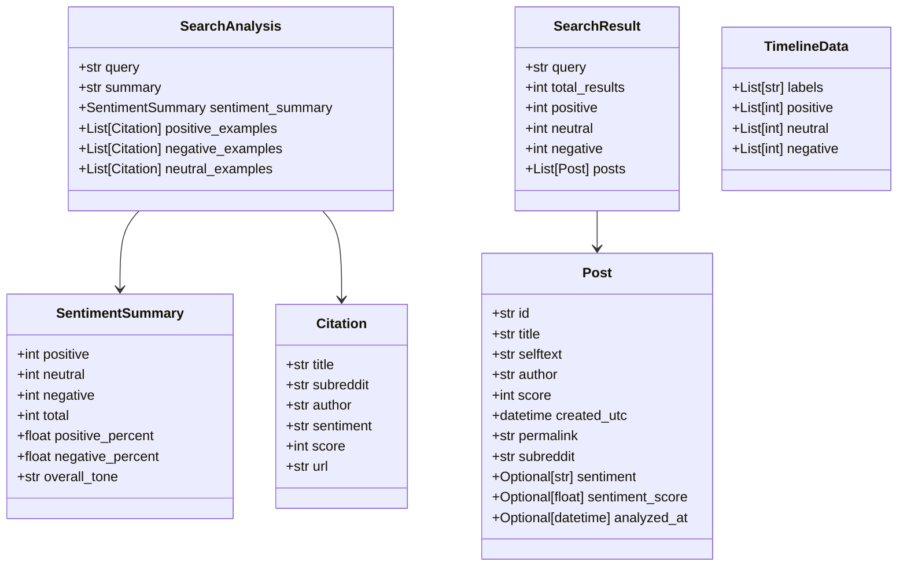
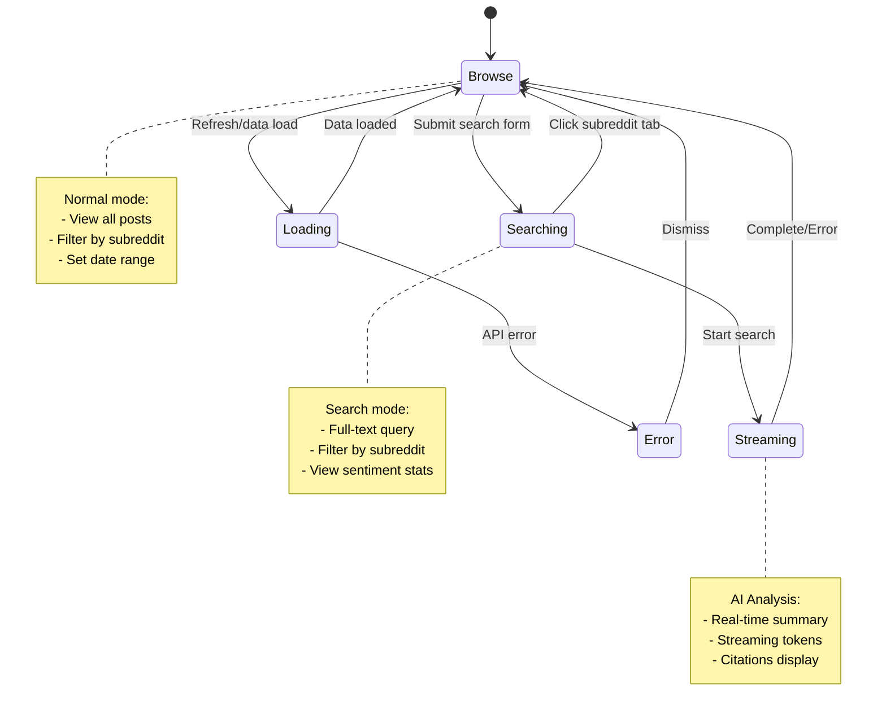
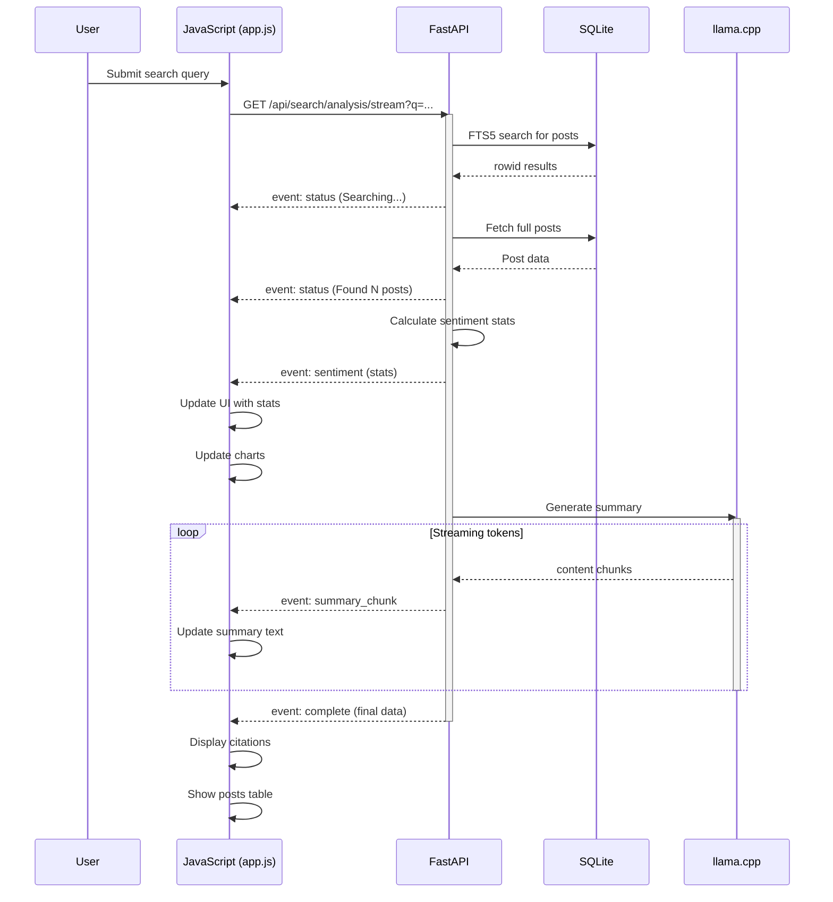
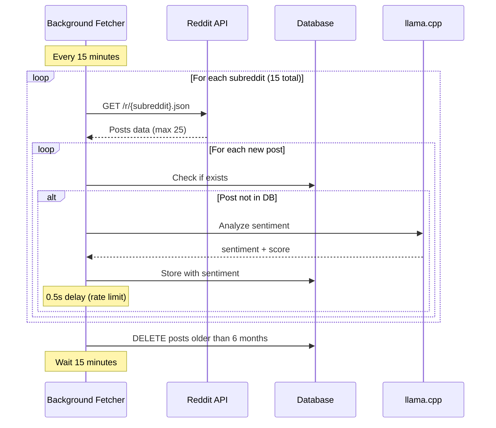
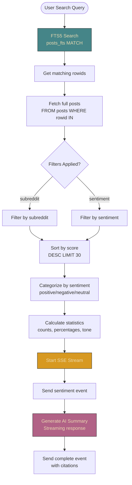
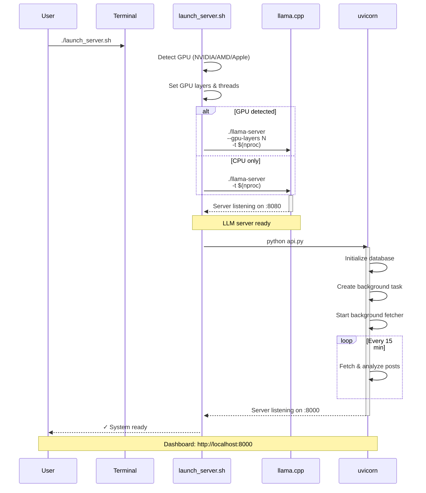

# Reddit Sentiment Analysis System - Architecture Documentation

## Table of Contents
1. [System Overview](#system-overview)
2. [High-Level Architecture](#high-level-architecture)
3. [Component Architecture](#component-architecture)
4. [Database Schema](#database-schema)
5. [API Reference](#api-reference)
6. [Frontend Architecture](#frontend-architecture)
7. [Data Flow](#data-flow)
8. [Deployment](#deployment)

---

## System Overview

The **Reddit Sentiment Analysis System** is a full-stack application that:
- Monitors 15 AI-related subreddits for new posts
- Analyzes sentiment using a local LLM (Qwen 3 4B via llama.cpp)
- Stores data in SQLite with full-text search (FTS5)
- Provides a web dashboard with real-time visualizations
- Offers AI-powered topic analysis with streaming responses

### Key Technologies

| Layer | Technology |
|-------|-----------|
| **Backend** | FastAPI (Python 3.10+) |
| **Database** | SQLite with FTS5 |
| **LLM Inference** | llama.cpp |
| **Model** | Qwen 3 4B Instruct (Q8 quantized, ~4.5GB) |
| **Frontend** | Vanilla JavaScript + Chart.js |
| **Communication** | REST API + Server-Sent Events (SSE) |

---

## High-Level Architecture



---

## Component Architecture

### 1. Backend Components

```mermaid
graph TB
    subgraph "FastAPI Application (api.py)"
        STARTUP([Lifespan Manager])

        subgraph "Data Collection"
            FETCH[fetch_reddit_posts<br/>Reddit JSON API Client]
            ANALYZE[analyze_sentiment<br/>LLM-based Classification]
            STORE[store_post<br/>Database Persistence]
        end

        subgraph "Background Tasks"
            BG_FETCHER[background_fetcher<br/>15-min Loop]
            CLEANUP[cleanup_old_posts<br/>6-month Retention]
        end

        subgraph "API Endpoints"
            GET_POSTS[/api/posts<br/>Get Filtered Posts]
            SEARCH[/api/search<br/>FTS5 Search]
            SEARCH_ANAL[/api/search/analysis<br/>AI Topic Analysis]
            STREAM[/api/search/analysis/stream<br/>SSE Streaming]
            DIST[/api/sentiment/distribution<br/>Stats by Period]
            TIME[/api/sentiment/timeline<br/>Time Series Data]
            STATS[/api/stats<br/>Overall Statistics]
        end

        subgraph "Database Layer"
            INIT[init_db<br/>Schema Setup]
            FTS_SYNC[FTS5 Triggers<br/>Auto-sync]
        end
    end

    STARTUP --> INIT
    INIT --> FTS_SYNC
    STARTUP --> BG_FETCHER
    BG_FETCHER --> FETCH
    BG_FETCHER --> CLEANUP
    FETCH --> ANALYZE
    ANALYZE --> STORE

    GET_POSTS --> DB_QUERY[(Database Query)]
    SEARCH --> DB_QUERY
    SEARCH_ANAL --> DB_QUERY
    SEARCH_ANAL --> LLAMA_CALL[(LLM Inference)]
    STREAM --> DB_QUERY
    STREAM --> LLAMA_CALL
    DIST --> DB_QUERY
    TIME --> DB_QUERY
    STATS --> DB_QUERY

    style STARTUP fill:#d79921,stroke:#282828,color:#ebdbb2
    style BG_FETCHER fill:#458588,stroke:#282828,color:#ebdbb2
    style SEARCH_ANAL fill:#b16286,stroke:#282828,color:#ebdbb2
    style STREAM fill:#b16286,stroke:#282828,color:#ebdbb2
```

### 2. Frontend Components



---

## Database Schema

### Tables and Relationships



### Indexes and Triggers

```mermaid
graph TB
    subgraph "SQLite Database"
        subgraph "Tables"
            POSTS[posts<br/>Main data]
            FTS[posts_fts<br/>FTS5 virtual table]
        end

        subgraph "Indexes"
            IDX1[idx_subreddit<br/>ON posts(subreddit)]
            IDX2[idx_created<br/>ON posts(created_utc)]
            IDX3[idx_sentiment<br/>ON posts(sentiment)]
        end

        subgraph "Triggers"
            TRG1[posts_ai<br/>AFTER INSERT]
            TRG2[posts_ad<br/>AFTER DELETE]
        end
    end

    POSTS --> IDX1
    POSTS --> IDX2
    POSTS --> IDX3
    TRG1 --> FTS
    TRG2 --> FTS
    POSTS -.->|sync| FTS

    style POSTS fill:#689d6a,stroke:#282828,color:#ebdbb2
    style FTS fill:#458588,stroke:#282828,color:#ebdbb2
```

**Schema SQL:**
```sql
-- Main posts table (api.py:156-175)
CREATE TABLE IF NOT EXISTS posts (
    id TEXT PRIMARY KEY,
    title TEXT,
    selftext TEXT,
    author TEXT,
    score INTEGER,
    ups INTEGER,
    downs INTEGER,
    num_comments INTEGER,
    created_utc TIMESTAMP,
    permalink TEXT,
    url TEXT,
    subreddit TEXT,
    sentiment TEXT,
    sentiment_score REAL,
    analyzed_at TIMESTAMP,
    fetched_at TIMESTAMP DEFAULT CURRENT_TIMESTAMP
);

-- FTS5 virtual table (api.py:178-185)
CREATE VIRTUAL TABLE IF NOT EXISTS posts_fts USING fts5(
    title,
    selftext,
    content='posts',
    content_rowid='rowid'
);

-- Triggers (api.py:188-200)
CREATE TRIGGER IF NOT EXISTS posts_ai AFTER INSERT ON posts BEGIN
    INSERT INTO posts_fts(rowid, title, selftext)
    VALUES (new.rowid, new.title, new.selftext);
END;

CREATE TRIGGER IF NOT EXISTS posts_ad AFTER DELETE ON posts BEGIN
    INSERT INTO posts_fts(posts_fts, rowid, title, selftext)
    VALUES('delete', old.rowid, old.title, old.selftext);
END;
```

---

## API Reference

### Endpoint Overview



### Detailed Endpoint Specifications

| Endpoint | Method | Params | Returns | Location |
|----------|--------|--------|---------|----------|
| `/` | GET | - | HTML page | api.py:448 |
| `/api/subreddits` | GET | - | `List[str]` | api.py:455 |
| `/api/posts` | GET | `subreddit`, `days`, `limit`, `sentiment` | `List[Post]` | api.py:1019 |
| `/api/search` | GET | `q`, `subreddits`, `limit`, `sentiment` | `SearchResult` | api.py:504 |
| `/api/search/analysis` | GET | `q`, `subreddits`, `limit` | `SearchAnalysis` | api.py:592 |
| `/api/search/analysis/stream` | GET | `q`, `subreddits`, `limit` | SSE Stream | api.py:737 |
| `/api/sentiment/distribution` | GET | `subreddit`, `days` | `SentimentDistribution` | api.py:1076 |
| `/api/sentiment/timeline` | GET | `subreddit`, `days` | `TimelineData` | api.py:1115 |
| `/api/stats` | GET | - | `Stats` | api.py:461 |
| `/api/analyze` | POST | `subreddit`, `limit` | `{message}` | api.py:1174 |

### Pydantic Data Models



---

## Frontend Architecture

### Application State



### SSE Event Flow



---

## Data Flow

### 1. Background Fetching Flow



### 2. Sentiment Analysis Flow

```mermaid
flowchart TD
    START([Reddit Post Fetched])

    TEXT[Extract Text<br/>title + selftext[:400]]
    PROMPT[Create Prompt<br/>Classify + Score]

    LLAMACALL[Call llama.cpp<br/>/completion endpoint]

    PARSE[Parse Response<br/>Extract sentiment/score]

    DECISION{Valid Response?}

    SUCCESS[Store in DB<br/>with sentiment]
    FAIL[Mark as neutral<br/>score = 0.0]

    START --> TEXT
    TEXT --> PROMPT
    PROMPT --> LLAMACALL
    LLAMACALL --> PARSE
    PARSE --> DECISION
    DECISION -->|Yes| SUCCESS
    DECISION -->|No/Error| FAIL

    style LLAMACALL fill:#b16286,stroke:#282828,color:#ebdbb2
    style SUCCESS fill:#689d6a,stroke:#282828,color:#ebdbb2
    style FAIL fill:#cc241d,stroke:#282828,color:#ebdbb2
```

### 3. Search & Analysis Flow



---

## Deployment

### System Startup Sequence



### Hardware Requirements

| Component | Minimum | Recommended |
|-----------|---------|-------------|
| **RAM** | 8GB | 16GB+ |
| **VRAM** | 0GB (CPU) | 5-6GB (GPU) |
| **Storage** | 6GB | 10GB+ |
| **CPU** | 4 cores | 8+ cores |
| **GPU** | - | NVIDIA RTX 3060+ |

### Configuration Files

**`.env` (optional):**
```bash
MODEL_PATH=./models/qwen2-7b-instruct-q8_0.gguf
LLAMA_SERVER_URL=http://localhost:8080
API_PORT=8000
```

**`pyproject.toml` key dependencies:**
```toml
[project]
name = "reddit-sentiment"
dependencies = [
    "fastapi>=0.104.0",
    "uvicorn[standard]>=0.24.0",
    "aiohttp>=3.9.0",
    "pydantic>=2.5.0",
]
```

---

## Performance Characteristics

### Current System State
- **307 analyzed posts** from 13 subreddits
- **Sentiment distribution:**
  - Positive: 47 (15.3%)
  - Neutral: 187 (60.9%)
  - Negative: 73 (23.8%)
- **Most active subreddits:** LocalLLaMA (30), ArtificialInteligence (29), MachineLearning (28)

### Performance Metrics
| Operation | Time | Notes |
|-----------|------|-------|
| **Sentiment analysis** | ~2-3s/post | GPU-accelerated |
| **Full-text search** | <100ms | FTS5 indexed |
| **Timeline query** | <200ms | Aggregated |
| **Topic analysis** | 5-10s | With LLM streaming |
| **Background fetch** | ~5-10min | 15 subreddits × 25 posts |

### Scaling Considerations
- **Database**: SQLite suitable for <10M posts
- **Inference**: llama.cpp scales with GPU VRAM
- **Concurrency**: FastAPI async handles high load
- **Search**: FTS5 provides O(log n) lookups

---

## Development Notes

### Code Organization

```
redditsenty/
├── api.py                 # FastAPI backend (1185 lines)
│   ├── Database setup (lines 150-231)
│   ├── Reddit fetcher (lines 233-269)
│   ├── Sentiment analysis (lines 272-329)
│   ├── Background tasks (lines 397-437)
│   └── API endpoints (lines 448-1179)
│
├── web/
│   ├── index.html        # Dashboard UI
│   └── js/
│       └── app.js        # Frontend logic (485 lines)
│           ├── Chart initialization (lines 83-127)
│           ├── Data loading (lines 129-174)
│           ├── Search handling (lines 176-314)
│           └── UI updates (lines 393-484)
│
├── reddit_fetcher.py     # Standalone fetcher (96 lines)
├── setup_model.sh        # Model download script
└── launch_server.sh      # Server launcher (134 lines)
```

### Key Design Patterns

1. **Async/Await**: All I/O operations use asyncio
2. **Context Manager**: Lifespan management for startup/shutdown
3. **Streaming**: SSE for real-time AI responses
4. **FTS5**: Triggers keep search index in sync
5. **Rate Limiting**: 0.5s delay between LLM calls
6. **Caching**: Duplicate posts skipped by ID

### Extension Points

- **Add subreddits**: Modify `AI_SUBREDDITS` list (api.py:25)
- **Custom prompts**: Edit `analyze_sentiment` function (api.py:274)
- **New charts**: Add to `initCharts` in app.js (line 83)
- **Additional filters**: Extend query parameters
- **Export functionality**: Add CSV/JSON endpoints

---

## License & Credits

This is an educational project demonstrating:
- FastAPI backend architecture
- Local LLM integration with llama.cpp
- SQLite FTS5 full-text search
- Server-Sent Events (SSE) streaming
- Modern JavaScript dashboard
- Real-time data visualization

**Model**: Qwen 3 4B Instruct by Alibaba Cloud
**Framework**: llama.cpp by Georgi Gerganov
